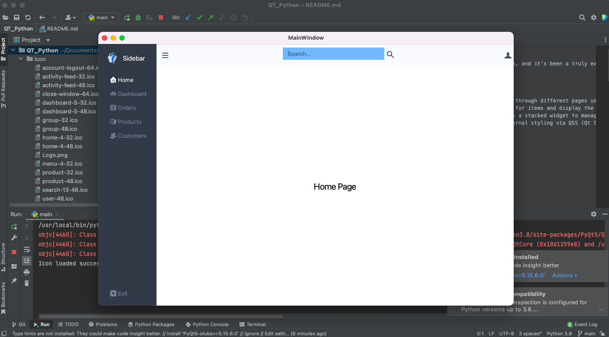

# PyQt5 Sidebar Navigation

I recently tried out Qt with Python, and it’s been a truly exciting experience! This project is a simple PyQt5 application that showcases a sidebar navigation interface. It allows users to seamlessly navigate between different pages—such as home, dashboard, orders, products, and customers—using intuitive buttons. Additionally, I’ve included a search functionality to enhance user interaction.



## Features

- **Sidebar Navigation**: Navigate through different pages using a sidebar.
- **Search Functionality**: Search for items and display the results.
- **Dynamic Content Display**: Uses a stacked widget to manage the visibility of different pages.
- **Custom Styling**: Supports external styling via QSS (Qt Style Sheets).

## Requirements

- Python 3.x
- PyQt5

## Installation

1. **Clone the repository**:

   ```bash
   git clone <repository_url>
   cd <repository_directory>
   ```

2. **Install the required packages**:

   If you haven't installed PyQt5, you can do so using pip:

   ```bash
   pip install PyQt5
   ```

## Usage

1. **Run the application**:

   Execute the following command:

   ```bash
   python main.py
   ```

2. **Loading the Style Sheet**:

   The application loads a QSS file (`style.qss`) for custom styling. Ensure that the `style.qss` file is present in the same directory as the main script.

3. **Icons**:

   The application uses icons specified in the resource file. Ensure that the resource file is properly set up and compiled. If you're using resource files, make sure to follow the instructions to compile the `.qrc` file into a Python module.

## File Structure

```
/project_root
│
├── main.py           # Main application file
├── sidebar_ui.py     # Generated UI code from Qt Designer
├── style.qss         # Custom styles for the application
└── resources_rc.py   # Compiled resource file for icons (if applicable)
```

## Code Explanation

- **MainWindow Class**: The main window of the application. It initializes the UI, sets up the sidebar, and defines functions for navigation and searching.
- **Stacked Widget**: The `QStackedWidget` is used to switch between different pages based on user interaction.
- **Icon Handling**: Icons are loaded from a resource file. Make sure the icons are properly defined in your `.qrc` file.

## Troubleshooting

- If the icons do not load, ensure that your resource file is correctly compiled and the paths in your `.qrc` file are correct.
- If you encounter any issues with loading the style sheet, make sure that the `style.qss` file is present and correctly formatted.

## Acknowledgments

- Thanks to the PyQt5 community for their support and resources.